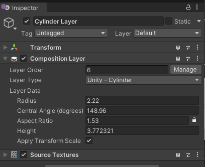
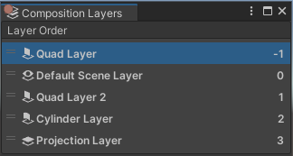

# Change layer order

Composition layers are drawn in order from most negative to most positive. You can set this drawing order in the Editor and modify it at runtime.

Composition layer drawing order does not depend on the camera or GameObject position. If you place two Composition Layers in a scene, the compositor draws them in the specified order no matter which layer is in front with respect to the current camera position.

Refer to [Set layer transparency](xref:xr-layers-transparency) for information about making layers behind the default scene layer visible. 
Refer to [Projection Eye Rig](xref:xr-layers-projection-eye-rig) for information about making 3D objects in the scene display in layers in front of the default scene layer.

<a name="sort-order"></a>
## Set the layer sort order in the Editor

The layer sort order determines the order in which layers are composited to the final display. In general, layers are composited in numerical order (most negative to most positive). Layers composited later in the order overwrite layers drawn earlier in the order. (However, a provider implementation can choose to use a different algorithm if it makes more sense for their device.)

You can set the sort order of an individual layer by editing the component’s __Layer Order__ property in the __Inspector__. When you change this value, you must choose a order that isn't already used by another layer in the scene.

<br />*A cylinder layer with its _Layer Order_ set to 6.*

Click the __Manage__ button to open the __Layer Order__ window, which lets you set the relative order of all of your composition layers. You can also open this window using the Unity Editor menu, __Window > XR > Composition Layers__.

<br />*The _Layer Order_ window*

The Default Scene Layer is an implicit Projection Layer to which the Unity scene is rendered. It always has an order of 0. Layers with a negative order are behind the Default Scene Layer. 

## Change the layer order at runtime

You can change the sorting order of layers at runtime in the following ways:

* Use [CompositionLayerUtils.TryChangeLayerOrder] to assign an order value to a layer without risk of assigning the same order as another layer. You can use [GetFirstUnusedLayer] or [GetNextUnusedLayer] to find unused slots in the sorting order.
* Use [CompositionLayerManager.TrySwapLayers] to switch the order values of two layers.
* Assign an order value directly to [CompositionLayer.order]. If the assigned value is already in use, then the first available, positive location in the sorting list is used instead.

Examples of setting the sorting order:

``` csharp
// Set order to first unused slot greater than 3
int nextOrder = CompositionLayerUtils.GetNextUnusedLayer(3, true);
CompositionLayerUtils.TryChangeLayerOrder(layerOne, layerOne.order, nextOrder);

// Set order to first unused slot less than 0
int nextUnderLayerOrder = CompositionLayerUtils.GetFirstUnusedLayer(false);
CompositionLayerUtils.TryChangeLayerOrder(layerOne, layerOne.order, nextUnderLayerOrder);

// Swap two layers
CompositionLayerManager.instance.TrySwapLayers(layerOne, layerTwo);

// Set directly -- fails if order already in use
layerOne.order = -3;
```
