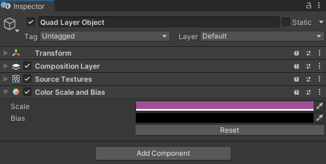
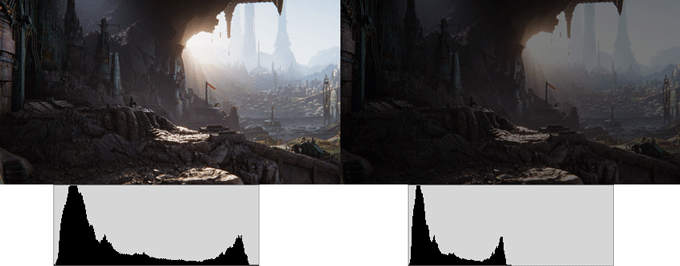
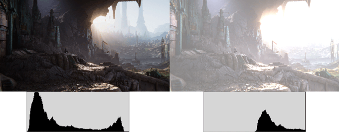
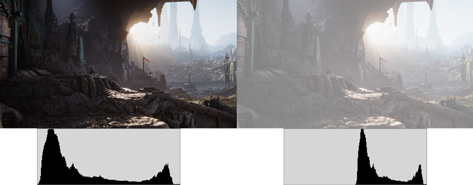

# Color Bias and Scale component

Add a __Color Bias and Scale__ extension component to apply a uniform color treatment to the layer. See [Add or remove a composition layer].

 *The Color Scale And Bias component Inspector*

| Property:| Function: |
|:---|:---| 
| Scale| Multiplies the components of the rendered colors in the layer by the corresponding scale value. Must be a value between 0 and 1 if using RGB 0-1.0 or between 0 and 255 if using RGB 0-255.  Setting the R, G, B, A values using Color picker. Setting the value of 1.0 or 255 leaves a channel unaltered.|
| Bias| Adds the corresponding bias value to the components of the rendered colors in the layer. Must be a value between 0 and 1 if using RGB 0-1.0 or between 0 and 255 if using RGB 0-255.  Setting the R, G, B, A values using Color picker. Setting the value of 0 leaves a channel unaltered.   Bias values are added after scaling is applied. |
| Reset| Click Reset button to reset both Scale and Bias values to the default unaltered values. |

#### Scale

Scaling compresses the colors in a texture towards 0, which is the minimum luminosity for color channels and completely transparent for the alpha channel:

 *A scale of (.5,.5,.5,1) applied to a texture when using RGB 0-1.0 setting*

#### Bias

Bias shifts the colors in a texture towards 1, which is maximum luminosity for color channels completely opaque for the alpha channel. The result is clipped if it exceeds 1:

 *A bias of (.5,.5,.5,1) applied to a texture when using RGB 0-1.0 setting*

#### Scale and Bias

If you specify non-identity values for both scale and bias, scale is applied first:

 *A scale of (.5,.5,.5,1) and a bias of (.5,.5,.5,1) both applied to a texture*

[Add or remove a composition layer]: xref:xr-layers-add-layer
