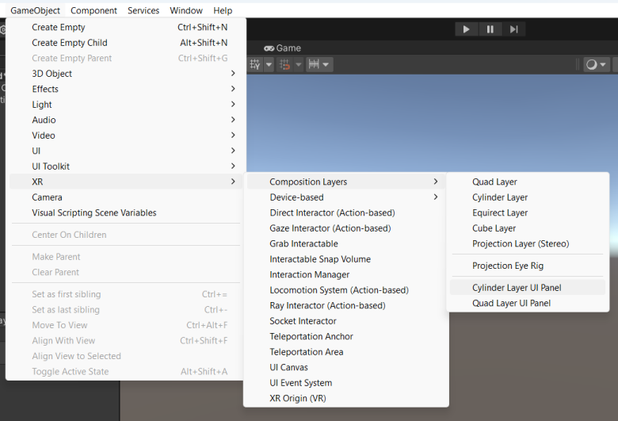
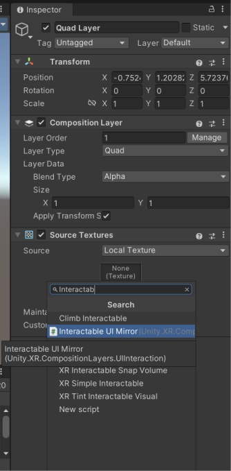
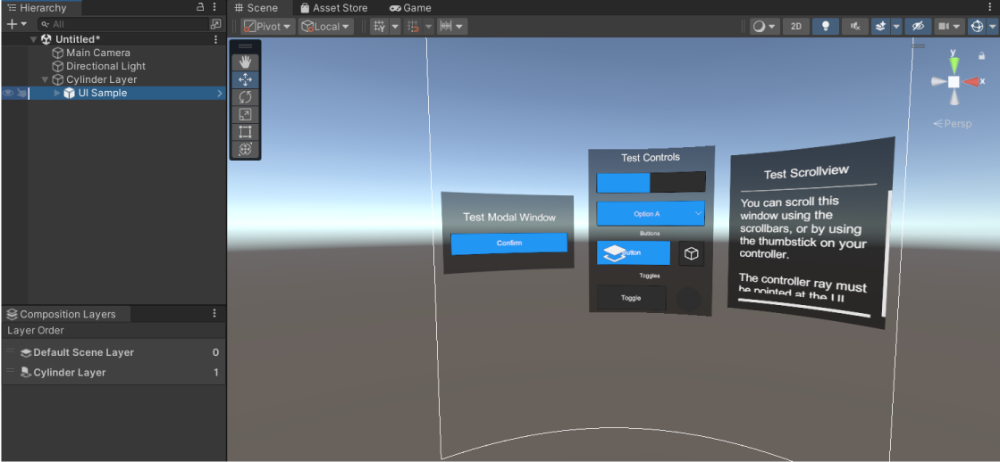
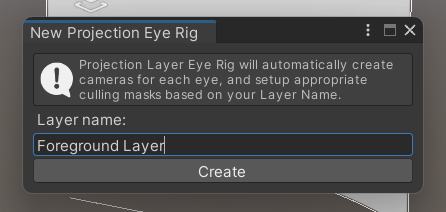
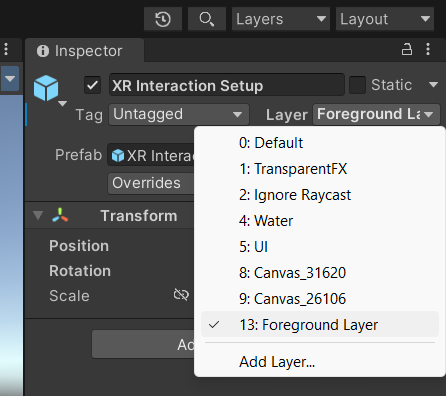
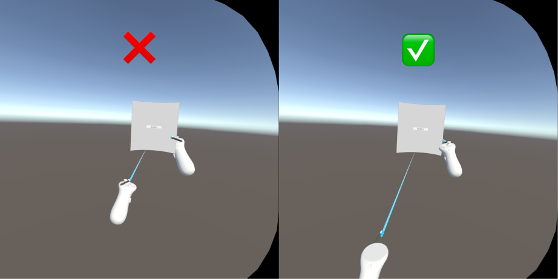
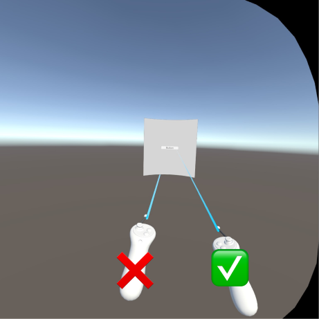

# Composition Layer Interactive UI

Composition Layers can render textures with great fidelity, which makes them ideal for displaying text and UIs. To that end, Unity provides a set of Composition Layer UI prefabs and components that will work with Unity UI Elements such as Canvases, Buttons, etc., with minimal setup.

|Prefab/Component:|Description:|
|:---|:---| 
|Quad UI Panel | prefab of a Quad layer with a Canvas that has been setup for interactivity |
|Cylinder UI Panel | prefab of a Cylinder layer with a Canvas that has been setup for for interactivity |
|Interactable UI Mirror | a Component that will configure a Quad or Cylinder layer with a Canvas that has been setup for interactivity|

 

> [!NOTE]
>  Composition Layer UI components are dependent on XR Interaction Toolkit. You will be prompt to install XRI into your project when you create a Composition Layer UI component if XRI is not already present.

## Create Composition Layer UI’s

The quickest way to create a new UI with Composition Layers is via the Create Menu. Go to **GameObject > XR > Composition Layers**, and then select either the **Quad UI Panel** or the **Cylinder UI Panel**.

 

When you’ve made your selection, Unity will create the corresponding shape layer and populate them with a Canvas and an Image for the background of the panel.

From there you can simply add additional UI Elements to the Canvas such as Text and Buttons, and you can interact with the interactive elements without any additional setup.

Another way to create a Composition Layer UI is by adding the **Interactable UI Mirror** component to an existing **Quad** or **Cylinder** layer.

 

When the Interactable UI Mirror is added to a Quad and Cylinder layer, Unity automatically sets up a Canvas inside of the Composition Layer similar to the above example.

## Convert existing UI Canvases

If you want to make your existing UIs render at higher fidelity you can easily convert them into Composition Layer UI elements.

1) First, take note of the dimension of your world space UI Canvas. 
2) Then create either a Quad or a Cylinder Composition Layer of similar size to that of your Canvas.
3) Then drag your Canvas into the Composition Layer making them a child of the Composition Layer.

 

And with that you will have a fully functioning Composition Layer UI from your old UI Canvas.

## How Composition Layer UI Components Work ##

Composition Layer UI components currently will only work with Quad or Cylinder layer type. And there can only be one Canvas in a Composition Layer UI at a time.

Behind the scene there is a hidden camera that captures the texture of the Canvas and projected onto the Composition Layer. Unity will automatically create a User Layer for that Canvas to cull it from the Main Camera so only the projected texture of the Canvas can be seen.

The Canvas texture will always be projected to fit on the Composition Layer without being cropped or distorted, with its aspect ratio preserved. The Composition Layer shape determines the size of the Canvas in World Space, and the Width and Height properties of the Canvas determines the resolution of the projected texture. 

To make the Composition Layer interactable, there is a collider inside the Composition Layer that mirror the size of the Canvas. Whenever users interact with the Composition Layer, those events are reprojected onto the Canvas allowing them to interact with the UI Elements.

> [!NOTE]
> Because Composition Layer UI uses User Layers for culling cameras and masking events, and since there are a limited number of User Layers per project (27), it is important that you limit the number of Composition Layer UIs you create and reuse them as much as possible.

## Working with XRI ##

By default Composition Layer UI works with the XR Interaction Toolkit. Simply import the XRI package into your project, and make use of any of the XR Rigs that are available through XRI, and you will be able to interact with Composition Layer UIs.

To display the XRI Rig in front of Composition Layer UIs, you will want to create a Projection Eye Rig and assign its user layer to the XRI Rig. That way the XRI Rig will render on the Projection Layer belonging to the Projection Eye Rig. Remember to reorder the Projection Eye Rig above the UI layers by giving it a higher order number.

 

 

Because the XRI Rig spawns the controller prefabs at runtime, the controller prefabs are not assigned to the Projection Eye Rig by default. You will have to manually assign the correct user layer to the controller prefabs for them to show up correctly with the rest of the XRI Rig.

 

You can reuse the user layer of the Projection Eye Rig in multiple scenes by giving the Projection Eye Rigs in those scene the same name. That way you will conserve the amount of user layers being used.

> [!WARNING]
> When you are play testing the scene in the Unity Editor with the Oculus Link Cable, the Ray Interactor of the XRI Rig will display incorrectly beneath all Cylinder layers. This is a known issue that only affects play mode with the Oculus Link Cable. A work-around to this bug is to assign a new UI Unlit Material to the Ray Interactor instead of the default material that it ships with.

 

