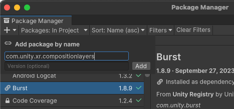

# Install  XR Composition Layers

XR Composition Layers is an official Unity package available via the [Package Manager](https://learn.unity.com/tutorial/the-package-manager).

## Editor compatibility

This version of Composition Layers is compatible with Unity Editor version 2022.3 and later.

## Required packages

The XR Composition Layers package contains interfaces, types, and emulation for accessing composition layers, but does not provide a runtime implementation. To use composition layers at runtime, you must also install an XR Provider plug-in that implements the [ILayerProvider](xref:Unity.XR.CompositionLayers.Provider.ILayerProvider) interface.

| Provider plug-in package | Version |
| :----------------------- | :------ |
| OpenXR                   | [1.12.0-exp.1](com.unity3d.kharma:upmpackage/com.unity.xr.openxr@1.12.0-exp.1)   |

## Installation

To install this package in Unity 2022.3+:

1. Open the project that you plan to use.
2. Click the following link: [com.unity.xr.compositionlayers](com.unity3d.kharma:upmpackage/com.unity.xr.compositionlayers).

   The Unity Package Manager window opens with the package name entered in the **Add package by name** dialog.

   

3. (Optional) Enter the full version number, such as `0.4.0`, to install. If left blank, Unity chooses the "best" version -- typically the latest, release version for the current Unity Editor.  See the [Changelog](xref:xr-layers-changelog) for a list of versions available at the time this documentation page was published.
4. Click **Add**.

After you install the package, refer to [Settings](xref:xr-layers-settings) for additional configuration information.
