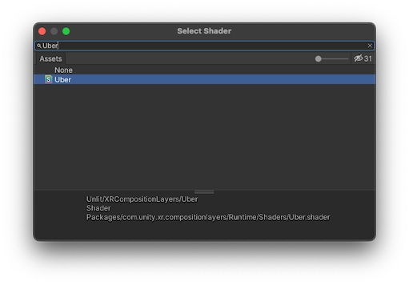
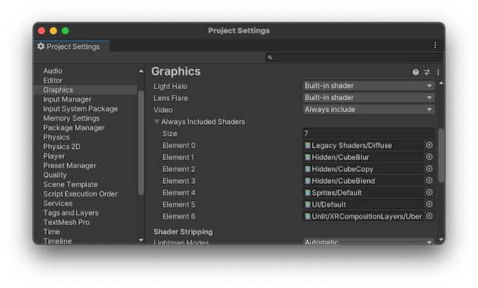
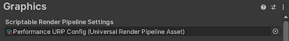
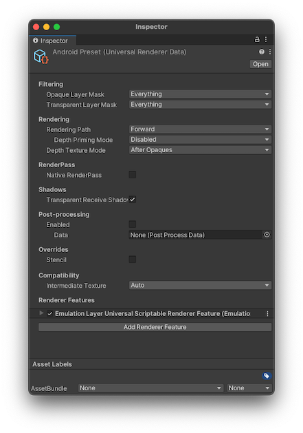
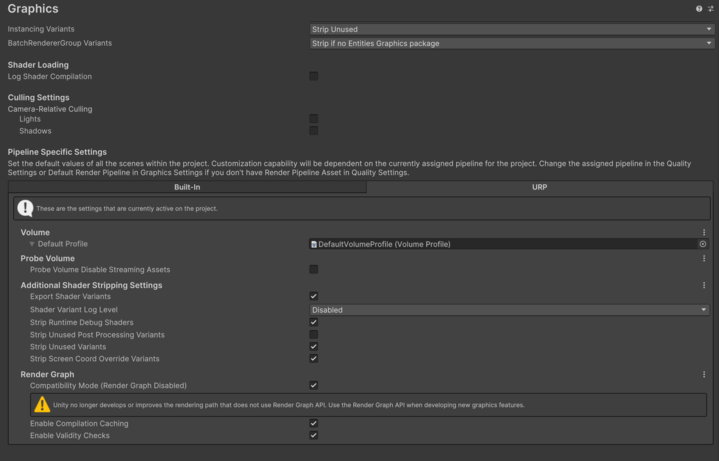

# Settings

The XR Composition Layers package provides some preferences that determine how composition layers are displayed in the Editor. There are also some [graphics settings](#graphics-settings) that you must adjust to ensure that the composition layers display correctly in the Editor and at runtime.

## Preferences

The XR Composition Layers package adds the following settings to the Unity **Preferences**:

| Setting | Description |
| :------ | :---------- |
| **Display Angles As** | Choose whether the various angle values that you can set in the Composition Layer components use **degrees** or **radians**. |
| **Emulation in Scene** | Show composition layers in the Scene view. |
| **Emulation In Play Mode** | Show composition layers in the Game view while in Play mode when no XR provider is active or no headset connected. |

> [!TIP]
> Emulation of composition layers is not perfect and can sometimes interfere with normal scene editing and troubleshooting. You can use the emulation preferences to turn off emulation in such cases.

Refer to [Preferences](xref:Preferences) for more information about the Unity Editor **Preferences** window.

## Runtime settings

To enable layer emulation in a standalone **Win, Mac, Linux** build:

1. Navigate to the **Assets/CompositionLayers/UserSettings/Resources** folder in your **Project** window. (This folder is created automatically when you import the XR Composition Layers package.)
2. Select the **CompositionLayersRuntimeSettings** asset to view its properties in the **Inspector**.
3. Enable the **Emulation in Standalone** option.

> [!TIP]
> You must also add the **Uber** shader to the [Always Include Shaders list](#always-include-shader-list) to make sure that this shader, which is needed to render emulated layers, is included in your standalone builds.

## Graphics settings

XR Composition Layers Emulation relys on a specific shader that must be added to the [Always Include Shaders list](#always-include-shaders-list) for the project.

If the project uses the Universal Render Pipeline (URP), then you must add the [Emulation Layer Renderer Feature](#emulation-layer-renderer-feature) to the **Universal Render Data** asset.

### Always Include Shaders list

For emulation of layers in a standalone **Win, Mac, Linux** build, add the `Unlit/XRCompositionLayers/Runtime/Uber` shader to the list of shaders that are always included in a project build:

1. Open the **Project Settings** window (menu: **Edit > Project Settings**).
2. Select the **Graphics** section.
3. Expand the **Always Included Shaders** list, if necessary.
4. Increase the **Size** value by one to add another element to the list.
5. Click the object picker icon of the new element to open the **Select Shader** dialog.
6. Click the crossed-out eye icon at the top, right-hand side of the dialog to include shaders in packages in the selection list -- otherwise, the Uber shader is not shown.
7. Type, "Uber" in the search field at the top of the dialog.

   
   
8. Double-click the **Uber** shader in the list to add it to the always included shaders.

 *The __Always Included Shaders__ list with the Uber shader successfully added* 

> [!TIP]
> Make sure that the **Emulation in Standalone** setting is enabled under [Runtime settings](#runtime-settings).

### Emulation Layer Renderer Feature (URP)

To support layer emulation in projects using the Universal Renderer Pipeline (URP, add the `EmulationLayerUniversalScriptableRendererFeature` to the Universal Renderer Data asset that the project uses:

1. Open the **Project Settings** window (menu: **Edit > Project Settings**).
2. Select the **Graphics** section.
3. Click on the asset assigned to the **Scriptable Render Pipeline Settings** field to locate the asset in the Project panel.
   
   
   
4. Select the asset in the Project panel to view its properties in the Inspector window.
5. Edit each item in the **Renderer List**, to add the renderer feature:

   * Open the Universal Render Data asset in the Inspector.
   * At the bottom of the window, click the **Add Renderer Feature** button.
   * In the pop-up menu, choose the **Emulation Layer Universal Scriptable Renderer Feature**.
   
     
    
> [!NOTE]
> If on MacOS with URP, Compatibility Mode (Render Graph Disable) must be selected to render emulated layers.
1. Open the **Project Settings** window (menu: **Edit > Project Settings**).
2. Select the **Graphics** section.
3. Click on the URP Tab.
4. Under the Render Graph section select **Compatibility Mode (Render Graph Disable)** button.

    