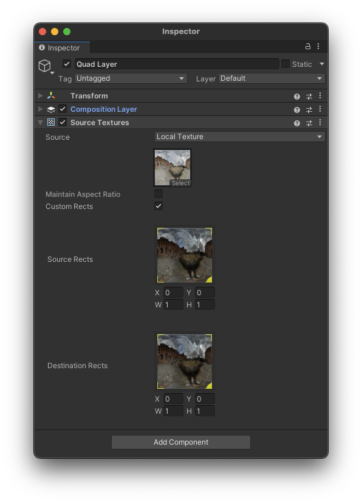
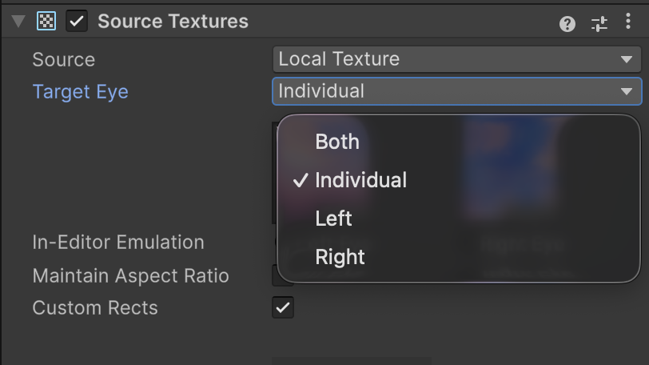
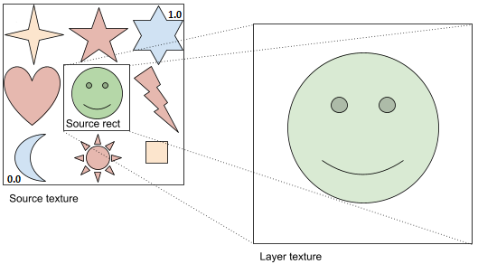
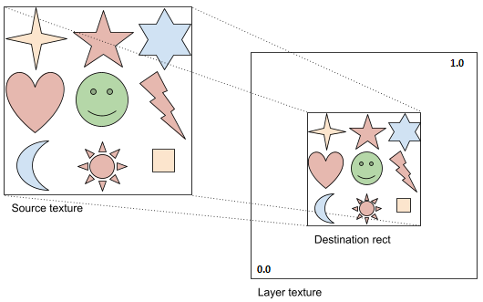

# Source Textures component

Add a Source Textures extension component to specify textures to render to a layer, as outlined in [Add or remove a composition layer](xref:xr-layers-add-layer). On Android, for Quad and Cylinder layer types, you can also specify an [Android Surface](#android-surface) as the source texture.

 *The Source Textures component Inspector*

| Property:| Function: |
|:---|:---|
| Source | Specify the source of the texture - Local Texture or Android Surface. |
| Target Eye | Controls which eye(s) see the layer, and whether separate textures are used per eye. Refer to [Target Eye options](#target-eye-options) for more information. |
| Texture (Local Texture Only)| Specify a texture to use. Click Select to choose a texture or drag-and-drop a texture onto the control with your mouse. |
| Resolution (Android Surface Only)| Specify the resolution for the Android Surface with X for width, and Y for height. |
| Maintain Aspect Ratio (Quad/Cylinder Layer/Android Surface Only)| Crop the layer to fit the aspect ratio of the texture. |
| In-Editor Emulation | Specify whether the left or right eye texture is shown in the Unity Editor. Shown for Projection layers and layers when you set **Target Eye** mode to **Individual**. |
| Custom Rects| Enable to specify custom rects within the source and destination textures. |
| Source Rects1| Specifies a rectangle within the source texture to copy to the destination rather than copying the entire texture. Use your mouse to set the rect values or enter them into the x, y, w, and h fields. |
| Destination Rects1| Specifies a target rectangle within the destination texture to which to write the source texture rather than filling the entire destination texture. Use your mouse to set the rect values or enter them into the x, y, w, and h fields. |

1 Custom source rects and custom destination rects are not supported by composition layers of cube projection or equirect types.

> [!NOTE]
> Different types of composition layers support different texture settings. Only the settings supported by the current type of layer are shown in the Inspector.

## Target Eye options

The **Target Eye** setting controls which eye(s) a composition layer is visible to, and whether separate textures can be assigned per eye. **Target Eye** is available for the standard Quad, Cylinder, Equirect, and Cube layer types. Projection layers always use stereo rendering.

 *The Target Eye dropdown*

| Option | Description |
|:---|:---|
| Both | The layer is visible to both eyes with a single shared texture. This is the default. |
| Individual | Allows you to assign separate textures for the left and right eyes. When you select this option, the **Inspector** shows two texture slots. Use the **In-Editor Emulation** toggle to preview each eye's texture. Choose **Individual** for content that should appear different in each eye. |
| Left | The layer is visible only to the left eye. |
| Right | The layer is visible only to the right eye. |

> [!NOTE]
> The Target Eye setting is not available for UI layers (layers with an **Interactable UI Mirror** component), or Android Surface Layers. Android Surface and UI layers always render to both eyes.

> [!NOTE]
> When you choose **Individual** in the **Target Eye** mode, each layer counts as two composition layers at runtime. Keep this in mind when managing the total number of active layers, as XR runtimes have a maximum layer count.

## Custom source rects

You can use a custom source rect to define a rectangle subset of the source texture to use. The upper left of the source texture is coordinate (0,0) and the lower right is coordinate (1,1). Likewise, the full width and height are normalized to (1,1).

 *A source rect of approximately (.3, .3, .3, .3)*

## Custom destination rects

You can use a custom destination rect to define where to place the texture within a composition layer. The upper left of the layer is coordinate (0,0) and the lower right is coordinate (1,1). Likewise, the full width and height are normalized to (1,1).

 *A destination rect of approximately (.25,.25,.5,.5)*

## Android Surface

When developing for Android, you can use Android Surfaces for efficiently rendering graphics or displaying content such as hardware decoded video. Refer to [Display Android Surface Content](xref:xr-layers-android-surface) for more information.
